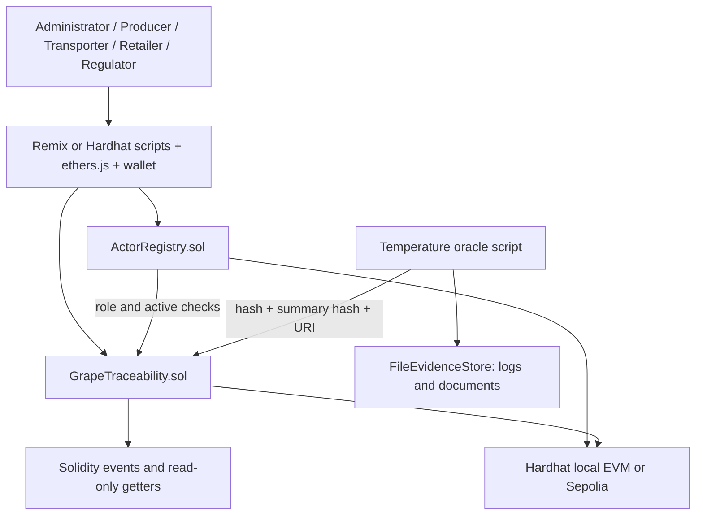
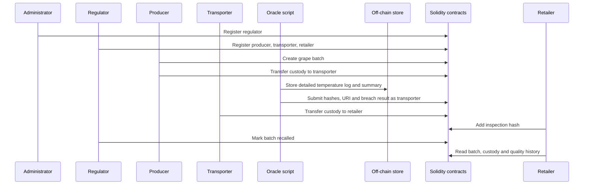

# Final Architecture

## Component-connector view

There is no traditional backend server. Hardhat/ethers scripts or Remix call the
contracts directly, and a wallet signs transactions on a public testnet.

## Main sequence

## FR mapping

| FR | Implementation |
| --- | --- |
| FR1 actor registration | `ActorRegistry.registerActor`, role limits and status management |
| FR2 batch registration | `GrapeTraceability.createBatch` restricted to active producers |
| FR3 custody transfer | `transferCustody` with current-custodian and role-transition checks |
| FR4 quality records | `addQualityRecord` stores hashes and URI, not detailed files |
| FR5 retrieve history | `getBatch`, `getCustodyHistory`, `getQualityHistory`, and events |
| FR6 flag and recall | `flagContaminated`, automatic breach flag, and `markRecalled` |

## NFR mapping

| NFR | Architecture response |
| --- | --- |
| Integrity and auditability | Immutable transactions, hashes, custody history and Solidity events |
| Privacy | Detailed logs and documents stay off-chain; only verification references are public |
| Transaction performance | Small on-chain records and no large documents reduce gas and confirmation work |
| Query performance | Direct getters return current state and bounded PoC histories |
| Reliability | Contract state and events remain available on the selected blockchain network |

## Task 2 feedback reflected in the final design

- Scope is limited to Producer -> Transporter -> Retailer, with Administrator and
  Regulator supporting enrolment and safety actions.
- FR1 actor enrolment and FR6 recall are implemented explicitly.
- "Authorised" is concrete: every write checks an active role and, where needed,
  current custody.
- Privacy is concrete: detailed evidence stays off-chain and hashes stay on-chain.
- The implementation is a deployable Solidity PoC rather than a traditional
  backend application.
